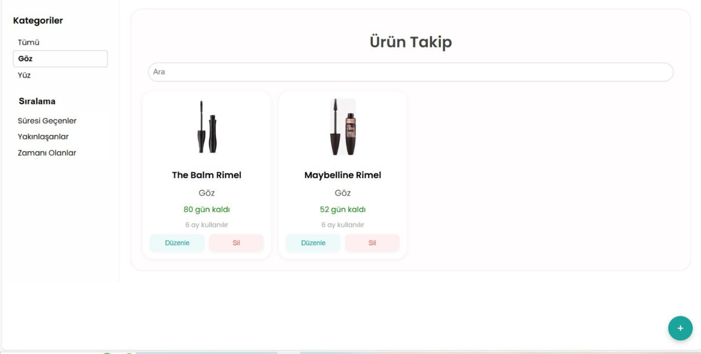
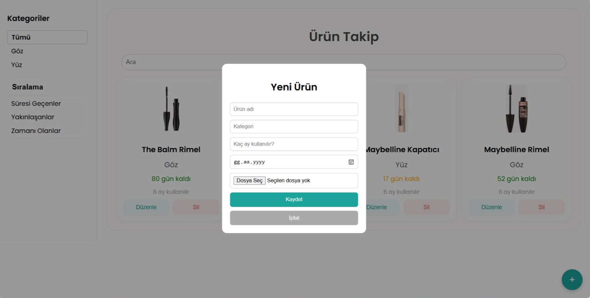
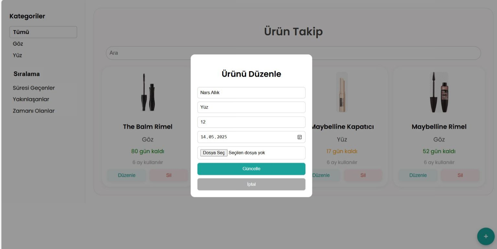

# Makyaj Takip Uygulaması

Makyaj Takip Uygulaması, makyaj ürünlerini takip etmek ve yönetmek için geliştirilmiş bir React tabanlı uygulamadır. Bu uygulama, kullanıcıların makyaj koleksiyonlarını takip etmesine, son kullanma tarihlerini kontrol etmesine ve güzellik ürünlerini yönetmesine yardımcı olur.

## Özellikler

- Detaylı bilgi ile makyaj ürünlerini takip etme
- Son kullanma tarihlerini izleme
- Kategori bazında ürün organizasyonu
- Kullanıcı dostu arayüz
- Tüm cihazlar için uyumlu tasarım

## Teknoloji Stack'i

- React
- Vite
- Kod kalitesi için ESLint
- Modern JavaScript/ES6+

## Başlarken

1. Repositoriyi klonlayın
2. Gereksinimleri yükleyin:
   ```bash
   npm install
   ```
3. Geliştirme sunucusunu başlatın:
   ```bash
   npm run dev
   ```

## Proje Yapısı

- `/src` - Kaynak kod dizini
- `/public` - Statik dosyalar
- `/node_modules` - Proje bağımlılıkları

## Geliştirme

Proje, hızlı geliştirme için Hot Module Replacement (HMR) özelliğine sahip Vite kullanır. Kod kalitesi için ESLint yapılandırılmıştır.

## Katkıda Bulunma

1. Repository'i forklayın
2. Özellik dalınızı oluşturun
3. Değişikliklerinizi commit edin
4. Değişiklikleri dalınıza push edin
5. Pull Request oluşturun










Bu proje MIT Lisansı altında lisanslanmıştır - detaylar için LICENSE dosyasına bakın.
